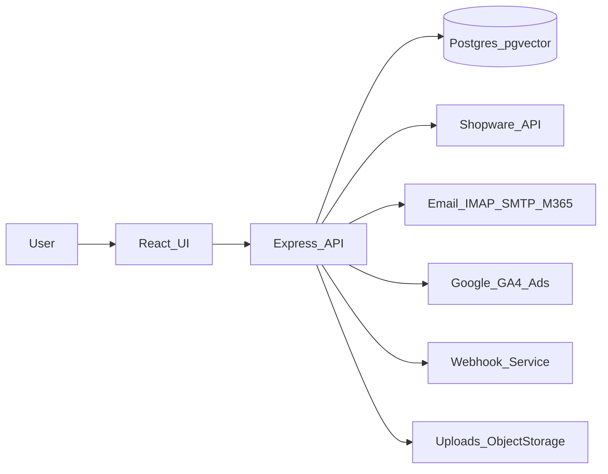

# Architekturueberblick

## Systemkomponenten

- **Frontend**: React + TypeScript (Vite), Routing via Wouter, UI via Tailwind + shadcn/ui.
- **Backend**: Express.js (TypeScript) als API und SPA-Server.
- **Datenbank**: PostgreSQL mit Drizzle ORM; pgvector fuer semantische Suche.
- **Dateispeicher**: Uploads unter `uploads/` (Docker-Volume, u. a. `installment-agreements/`).
- **Docker**: Image und Compose-Beispiel im Projektroot; Details [docker.md](docker.md).
- **Integrationen**:
  - Shopware 6 API (Bestellungen, Produkte, Angebote)
  - B2B Sellers Suite (Angebote)
  - E-Mail (IMAP/SMTP, optional M365)
  - Google Analytics/Ads KPIs
  - Webhooks (n8n/Zapier u. a.)

## High-Level Datenfluss

## Backend-Start und Hintergrundjobs

Aus `server/index.ts`:

- Session- und CSRF-Setup, Security-Header.
- Registrierung der API-Routen und SPA-Fallback.
- **Hintergrundjobs**:
  - Cross-Selling Learning (regelmaessig)
  - Offer Learning (regelmaessig)
  - E-Mail Polling (regelmaessig)
  - Dunning/Mahnwesen (regelmaessig)

## Authentifizierung & Berechtigungen

- Session-basierte Auth mit httpOnly-Cookies.
- CSRF-Schutz (Double-Submit Cookie Pattern).
- Rollen und Permissions auf API-Ebene enforced (siehe `server/auth.ts` und `shared/schema.ts`).

## Datenmodelle (Kurzueberblick)

Zentrale Typen/Tabellen in `shared/schema.ts`:

- **User/Roles/Tenants**: Mehrmandantenfaehigkeit mit Rollenrechten.
- **Orders/Offers/Products**: Shopware-Abbildungen fuer UI/Reporting.
- **Tickets**: Ticketing, Kommentare, Anhänge, Regeln, Aktivitaet.
- **Automation**: Regeln, Ausfuehrungshistorie.
- **Cross-Selling**: Regeln, AI-Regeln, Staging, Co-Occurrences.
- **Semantic**: Dokumente mit Embeddings fuer Suche/FAQ.

## Semantische Suche

- Texte werden in `semantic_documents` gespeichert.
- Embeddings via `semanticEmbeddings` erzeugt.
- Suche und FAQ ueber dedizierte API-Endpunkte.

## System-Poster (Gesamtdiagramm)

Ein zusammenhaengendes Mermaid-Poster (Nutzer, Stack, Persistenz, Integrationen, Docker): [metaorder-system-poster.md](metaorder-system-poster.md).

## Mandanten, Integration, Strikter Modus

Siehe [multitenant-security.md](multitenant-security.md) (Cross-Selling-Fallbacks, `METAORDER_STRICT_TENANT`, API-Keys pro Mandant, Performance-Hinweise).
