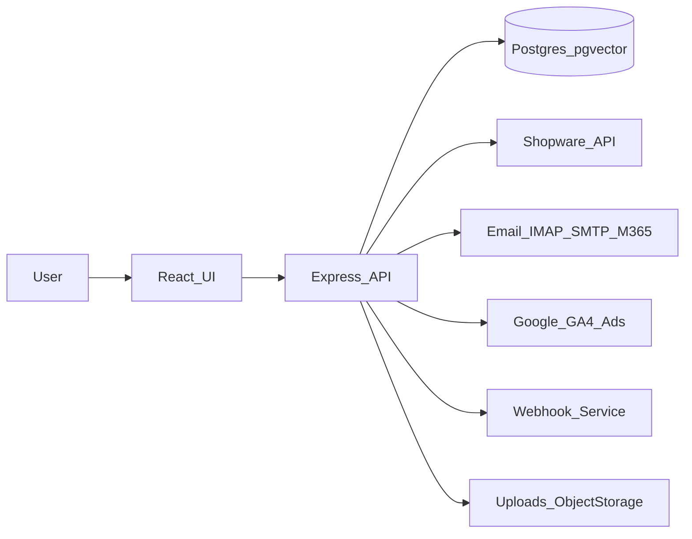

# Architekturueberblick

## Systemkomponenten

- **Frontend**: React + TypeScript (Vite), Routing via Wouter, UI via Tailwind + shadcn/ui.
- **Backend**: Express.js (TypeScript) als API und SPA-Server.
- **Datenbank**: PostgreSQL mit Drizzle ORM; pgvector fuer semantische Suche.
- **Dateispeicher**: Uploads unter `uploads/` (Docker-Volume, u. a. `installment-agreements/`).
- **Docker**: Image und Compose-Beispiel im Projektroot; Details [docker.md](docker.md).
- **Integrationen**:
  - Shopware 6 API (Bestellungen, Produkte, Angebote)
  - B2B Sellers Suite (Angebote)
  - E-Mail (IMAP/SMTP, optional M365)
  - Google Analytics/Ads KPIs
  - Webhooks (n8n/Zapier u. a.)

## High-Level Datenfluss

```mermaid
flowchart LR
  user[User] --> ui[React_UI]
  ui --> api[Express_API]
  api --> db[(Postgres_pgvector)]
  api --> shopware[Shopware_API]
  api --> mail[Email_IMAP_SMTP_M365]
  api --> google[Google_GA4_Ads]
  api --> webhook[Webhook_Service]
  api --> storage[Uploads_ObjectStorage]
```

## Ordnerstruktur Backend (`server/`)

Direkt unter `server/` liegen nur App-Einstieg und Infrastruktur: `index.ts`, `routes.ts`, `vite.ts`, `db.ts`, `storage.ts`/`dbStorage.ts`, `uploadsRoot.ts`, `seedData.ts`. `db.ts` und `uploadsRoot.ts` lösen Pfade relativ zu `server/` auf (`..` = Projektroot) und müssen deshalb dort bleiben.

| Ordner | Inhalt |
|---|---|
| `ai/` | LLM-/OpenAI-Clients, KI-Einstellungen |
| `analytics/` | Auswertungen, NL-Analytics, Prognosen, GA/Ads-KPIs, Profitabilität |
| `auth/` | Login/Session, Kunden-Auth, JWT |
| `b2b/` | B2B-Sellers-Suite: Client, Admin, Portal-Benutzer |
| `commercial/` | KI-Pipeline für eingehende Anfragen/Bestellungen (Drafts, Agent, Bestätigungen) |
| `cpq/`, `cpq-core/` | Konfigurator, Preisfindung, Raumplaner |
| `cross-selling/` | Cross-Selling-Regeln, Ranking, Lernen |
| `email/` | IMAP/SMTP/M365, Parsing, Klassifikation, Routing |
| `erp/` | Warenwirtschaft, Lager, Versand |
| `extraction/` | Dokument-Extraktion (PDF/E-Mail → strukturierte Daten), Normalisierung |
| `invoicing/` | Rechnungen, Teilzahlung, Mahnwesen, Mondu, Buchhaltungsabgleich |
| `lib/` | Querschnitt: Mandantenkontext, Verschlüsselung, Webhooks, Object Storage, Caches |
| `offers/` | Angebote: PDF, öffentliche Angebotsseite, ERP-Export |
| `pdf/` | Gemeinsames Briefpapier und Logo für alle PDFs |
| `products/` | Produktcache, Matching, Preise, Herstellpreise |
| `semantic/` | Embeddings, semantische Suche, FAQ |
| `sftp/` | SFTP-Server und Upload |
| `shopware/` | Shopware-API-Client, Spiegelung, Token-Cache |
| `tickets/` | Ticket-KI, Automatisierung |

### Shopware-Client (`server/shopware/`)

`ShopwareClient` (`shopware.ts`) enthält nur den Kern: Felder, Konstruktor, Authentifizierung, `makeAuthenticatedRequest` und generische Helfer (`searchEntity`, Fingerprints, Nummernkreise). Die fachlichen Methoden liegen je Ressource in `client/*.ts` als Funktionen mit `this: ShopwareClient` und werden am Ende von `shopware.ts` am Prototyp installiert (für TypeScript per Interface-Merging deklariert). Für Aufrufer ändert sich nichts: weiter `new ShopwareClient(settings)` und `client.fetchOrders(…)`.

| Datei | Inhalt |
|---|---|
| `client/orders.ts` | Bestellungen lesen/anlegen, Status-Mapping, Fingerprints, Auswertungsdaten |
| `client/delivery.ts` | Versand (Lieferstatus, Versandmeldung), Mondu-Transaktionen |
| `client/documents.ts` | Rechnung, Lieferschein, Proforma, Mahnung, PDFs, Rechnungsversand |
| `client/products.ts` | Produkte, Suche, Datenqualität, Aktiv/Bestand/Preise, Kategorien, Kanäle, 3D-Modell |
| `client/crossSelling.ts` | Produkt-Cross-Selling in Shopware |
| `client/customers.ts` | Kunden, B2B-Portal-Benutzer, Storefront-Login |
| `client/pricing.ts` | Kundenpreise, Rabatte, Herstellpreise, Währungen, Individualpreis-Index |
| `client/offers.ts` | Angebote (B2B Sellers) |
| `client/masterData.ts` | Verkaufskanäle, Kategorien, Felder, Lieferzeiten, Standardwerte, Länder |
| `client/types.ts`, `client/mapping.ts` | Typen bzw. Mapping-/Normalisierungsfunktionen und Konstanten |

Neue Shopware-Methoden: als `export async function name(this: ShopwareClient, …)` im passenden `client/*.ts` anlegen und im `interface ShopwareClient` am Ende von `shopware.ts` eintragen.

### API-Routen (`server/routes/`)

`server/routes.ts` registriert nur noch die Bereichsmodule; die Routen liegen je Bereich in einer Datei mit einer `register…Routes(app)`-Funktion. Neue Routen gehören in das passende Modul (Reihenfolge-Hinweise stehen im Kopfkommentar von `routes.ts`).

| Datei | Pfade |
|---|---|
| `authRoutes.ts` | `/api/auth` (ohne M365), `/api/profile` |
| `userRoutes.ts` | `/api/users`, `/api/roles`, `/api/tenants` |
| `settingsRoutes.ts` | `/api/settings` |
| `orderRoutes.ts` | `/api/orders`, `/api/installment-plans` |
| `offerRoutes.ts` | `/api/offers` |
| `draftRoutes.ts` | `/api/order-drafts`, `/api/offer-drafts`, `/api/commercial-drafts`, `/api/commercial-agent` |
| `productRoutes.ts` | `/api/products`, `/api/bundles` |
| `crossSellingRoutes.ts` | `/api/cross-selling`, `/api/cross-selling-rules` |
| `crmRoutes.ts` | `/api/crm` |
| `ticketRoutes.ts` | `/api/tickets`, `/api/portal`, `/api/templates`, `/api/ticket-assignment-rules`, `/api/automation-rules`, `/api/attachments`, `/api/parse-email` |
| `aiRoutes.ts` | `/api/ai`, `/api/semantic` |
| `analyticsRoutes.ts` | `/api/analytics`, `/api/dashboard` |
| `notificationRoutes.ts` | `/api/notifications` |
| `masterDataRoutes.ts` | `/api/sales-channels`, `/api/categories`, `/api/search`, `/api/b2b` (Nachschlagewerte) |
| `integrationRoutes.ts` | `/api/email`, `/api/m365`, `/api/auth/m365`, `/api/webhooks`, `/api/cpq/public/offer-request` |
| `invoicingRoutes.ts` | `/api/dunning`, `/api/accounting` |
| `operationsRoutes.ts` | `/api/shipping`, `/api/carriers`, `/api/process-updates`, `/api/erp-automation`, `/api/debug` |
| `routeHelpers.ts` | gemeinsame Helfer (Verkaufskanal-Filter, Ticket-Zuweisung/-SLA, Anhang-Pfade, Bestell-Cache) |

Weitere Routen-Module liegen bei ihrer Domäne: `erp/erpRoutes.ts`, `cpq/cpqRoutes.ts`, `cpq-core/cpqCoreRoutes.ts`, `b2b/b2bAdminRoutes.ts`, `offers/publicOfferRoutes.ts`, `sftp/sftpRoutes.ts`, `commercial/commercialAcknowledgementRoutes.ts`. Die OpenAPI-Pfade erzeugt `scripts/generate-openapi-paths.mjs` beim Build aus allen `.ts`-Dateien unter `server/` (Muster `app.get("/api/...")` usw.) – neue Routen-Module muss man dort also nicht eintragen. `tests/unit/routeRegistry.test.ts` registriert alle Routen wie beim Start und prüft, dass keine Route von einer früher registrierten Parameter-Route (z. B. `/api/orders/:orderId`) verdeckt wird und die OpenAPI-Liste genau den registrierten `/api`-Routen entspricht.

## Backend-Start und Hintergrundjobs

Aus `server/index.ts`:

- Session- und CSRF-Setup, Security-Header.
- Registrierung der API-Routen und SPA-Fallback.
- **Hintergrundjobs**:
  - Cross-Selling Learning (regelmaessig)
  - Offer Learning (regelmaessig)
  - E-Mail Polling (regelmaessig)
  - Dunning/Mahnwesen (regelmaessig)

## Authentifizierung & Berechtigungen

- Session-basierte Auth mit httpOnly-Cookies.
- CSRF-Schutz (Double-Submit Cookie Pattern).
- Rollen und Permissions auf API-Ebene enforced (siehe `server/auth/auth.ts` und `shared/schema.ts`).

## Datenmodelle (Kurzueberblick)

Zentrale Typen/Tabellen in `shared/schema.ts`:

- **User/Roles/Tenants**: Mehrmandantenfaehigkeit mit Rollenrechten.
- **Orders/Offers/Products**: Shopware-Abbildungen fuer UI/Reporting.
- **Tickets**: Ticketing, Kommentare, Anhänge, Regeln, Aktivitaet.
- **Automation**: Regeln, Ausfuehrungshistorie.
- **Cross-Selling**: Regeln, AI-Regeln, Staging, Co-Occurrences.
- **Semantic**: Dokumente mit Embeddings fuer Suche/FAQ.

## Semantische Suche

- **Index:** Texte (Produkte, Angebote, Angebots-/Bestellentwuerfe, Tickets, Ticket-Vorlagen) stehen je Mandant in `semantic_documents`. Den Index pflegt `server/semantic/semanticIndexer.ts` inkrementell: Neu berechnet werden nur Dokumente mit geaendertem Inhalt oder mit einem lokalen Embedding einer aelteren Version. Er laeuft etwa 2 Minuten nach dem Start und dann alle 6 Stunden (`SEMANTIC_INDEX_ENABLED`, `SEMANTIC_INDEX_INTERVAL_HOURS`), manuell unter Einstellungen → KI.
- **Embeddings** (`server/semantic/semanticEmbeddings.ts`): OpenAI oder lokal `local-hash-v2` (Woerter per Hash, jedes Wort einmal, lange Nummern nicht im Vektor).
- **Suche** (`dbStorage.searchSemanticDocuments`, Reihenfolge in `server/semantic/semanticRanking.ts`): Kandidaten aus Vektor- und Wortsuche, Ranking aus Vektor, Wortanteil, Metadaten und Rueckmeldungen. Bei lokalem Embedding zaehlt der Vektor ein Viertel, eine exakte Nummer steht vorn. FAQ und Suche laufen ueber dedizierte API-Endpunkte. Details: [ki-funktionen.md](ki-funktionen.md).
- **Produktseite** (`/api/products`): Wortsuche im Produkt-Spiegel mit Relevanz (`server/products/productSearchRanking.ts`), keine Vektoren.

## System-Poster (Gesamtdiagramm)

Ein zusammenhaengendes Mermaid-Poster (Nutzer, Stack, Persistenz, Integrationen, Docker): [metaorder-system-poster.md](metaorder-system-poster.md).

## Mandanten, Integration, Strikter Modus

Siehe [multitenant-security.md](multitenant-security.md) (Cross-Selling-Fallbacks, `METAORDER_STRICT_TENANT`, API-Keys pro Mandant, Performance-Hinweise).

## Logging

- **Zentraler Logger:** `server/lib/logger.ts` (pino). Produktion: eine JSON-Zeile je Eintrag; Entwicklung: lesbare Zeilen. Steuerung über `LOG_LEVEL` / `LOG_FORMAT` (siehe [docker.md](docker.md)).
- **Kontext automatisch:** Jede Zeile während einer Anfrage trägt `requestId` (auch im Antwort-Header `X-Request-Id`) und – nach der Anmeldung – `tenantId` (`server/lib/requestContext.ts`, `server/lib/tenantContext.ts`). Hinter multer stellt `restoreTenantContext` beides wieder her.
- **Modul-Logger:** Jedes Server-Modul loggt ueber `const log = logger.child({ component: "<Pfad unter server/>" })`, z. B. `routes/orderRoutes`. Fehler kommen als Feld `err` (mit Stacktrace), Werte als Felder: `log.info({ orderId }, "Bestellung angelegt")`, `log.error({ err }, "Versand fehlgeschlagen")`. Im Server gibt es kein `console.*` mehr (`tests/unit/noConsoleInServer.test.ts`); `server/lib/consoleBridge.ts` leitet nur noch `console`-Ausgaben von Bibliotheken in den Logger um.
- **Auswerten nach Komponente** (JSON-Logs): `jq -c 'select(.component=="routes/orderRoutes" and .level=="error") | {time, msg, err: .err.message}'`.
- **Hintergrund-Jobs ohne Anfrage** binden ihren Kontext per Kind-Logger: `logger.child({ component, tenantId })`. Ein gebundenes `tenantId` hat Vorrang vor dem Kontext (kein doppeltes Feld). Umgestellt sind Shopware-Spiegel (`component: "shopware-mirror"`, `entity`, Zählwerte, `durationMs`) und Rechnungs-Watcher (`component: "invoice-watcher"`, `orderId`, `invoiceNumber`, `outcome`); die Texte blieben dabei gleich. Beispiel (JSON-Logs): `jq -c 'select(.component=="shopware-mirror" and .durationMs) | {time, tenantId, entity, upserted, durationMs}'` listet alle Spiegel-Läufe mit Dauer.
- **Request-Log und Fehler-Handler:** `server/lib/httpLogging.ts` — eine Zeile je API-Anfrage (`component: "http"`, Methode, Pfad, Status, Dauer, IDs), **ohne Antwort-Inhalt**. Stufe nach Status: 5xx = `error`, 4xx = `warn` (außer 401 und 404), sonst `info`. Unbehandelte Fehler mit Stacktrace und `requestId`.
- **Bereiche (`area`):** Jede Zeile trägt einen Fachbereich: Bestellungen, Angebote, Belege/Entwürfe, Shopware, B2B, CRM, Produkte, CPQ, Cross-Selling, ERP, Versand, Rechnungen, E-Mail, Schnittstellen, Automatisierung, Tickets, KI, Auswertungen, Anmeldung, Einstellungen, System (`shared/logAreas.ts`).
  - Modul-Logger bekommen ihn aus `component`, Anfragen aus dem Pfad, ältere Texte aus dem Präfix `[Name]` (`server/lib/logAreas.ts`).
  - Ein neues Modul braucht eine Regel dort, sonst schlägt `tests/unit/systemLog.test.ts` fehl.
  - Beispiel: `jq -c 'select(.area=="shopware" and .level=="error")'`.
- **Stufen:** `info` für Vorgänge, die man im Protokoll sehen will (Anmeldung erfolgreich, Abgleich gelaufen, Regel ausgeführt), `warn` für Abgelehntes oder Übersprungenes, `error` für Fehler. Zwischenschritte und Cache-Treffer stehen auf `debug` (nur mit `LOG_LEVEL=debug`).
- **Systemprotokoll (Viewer für Administratoren, `/admin/logs`):**
  - Jede Zeile ab `info` landet zusätzlich gebündelt in der Tabelle `app_logs` (`server/lib/logStore.ts`, alle 2 s, Puffer höchstens 5000 Einträge). Ausgenommen sind erfolgreiche Lese-Anfragen (GET unter 400 und 401).
  - Fällt die Datenbank aus, gehen Einträge verloren statt den Server zu bremsen; die Zahl steht danach als eigener Eintrag im Protokoll.
  - Aufbewahrung `LOG_STORE_DAYS` (Standard 14), tägliches Aufräumen. `LOG_STORE=off` schaltet das Speichern ab.
  - Der Viewer filtert nach Zeitraum, Stufe, Bereich, Text (auch in Feldern wie Bestellnummern), Benutzer und Anfrage. Er zeigt den aktiven Mandanten plus Systemmeldungen und die Zahl der Warnungen und Fehler je Bereich.
  - API: `GET /api/admin/logs`, `GET /api/admin/logs/stats`, nur Rolle Administrator.
- **Schwärzung:** Felder wie `password`, `token`, `apiKey`, `apiSecret`, `authorization`, `cookie` sowie der Roh-Body kaputter JSON-Anfragen (`err.body`) werden als `[REDACTED]` geloggt.
