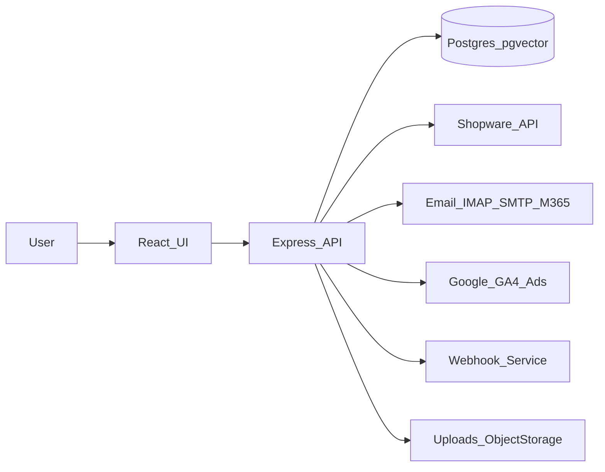

# Architekturueberblick

## Systemkomponenten

- **Frontend**: React + TypeScript (Vite), Routing via Wouter, UI via Tailwind + shadcn/ui.
- **Backend**: Express.js (TypeScript) als API und SPA-Server.
- **Datenbank**: PostgreSQL mit Drizzle ORM; pgvector fuer semantische Suche.
- **Dateispeicher**: Uploads unter `uploads/` (Docker-Volume, u. a. `installment-agreements/`).
- **Docker**: Image und Compose-Beispiel im Projektroot; Details [docker.md](docker.md).
- **Integrationen**:
  - Shopware 6 API (Bestellungen, Produkte, Angebote)
  - B2B Sellers Suite (Angebote)
  - E-Mail (IMAP/SMTP, optional M365)
  - Google Analytics/Ads KPIs
  - Webhooks (n8n/Zapier u. a.)

## High-Level Datenfluss

```mermaid
flowchart LR
  user[User] --> ui[React_UI]
  ui --> api[Express_API]
  api --> db[(Postgres_pgvector)]
  api --> shopware[Shopware_API]
  api --> mail[Email_IMAP_SMTP_M365]
  api --> google[Google_GA4_Ads]
  api --> webhook[Webhook_Service]
  api --> storage[Uploads_ObjectStorage]
```

## Ordnerstruktur Backend (`server/`)

Direkt unter `server/` liegen nur App-Einstieg und Infrastruktur: `index.ts`, `routes.ts`, `vite.ts`, `db.ts`, `storage.ts`/`dbStorage.ts`, `uploadsRoot.ts`, `seedData.ts`. `db.ts` und `uploadsRoot.ts` lösen Pfade relativ zu `server/` auf (`..` = Projektroot) und müssen deshalb dort bleiben.

| Ordner | Inhalt |
|---|---|
| `ai/` | LLM-/OpenAI-Clients, KI-Einstellungen |
| `analytics/` | Auswertungen, NL-Analytics, Prognosen, GA/Ads-KPIs, Profitabilität |
| `auth/` | Login/Session, Kunden-Auth, JWT |
| `b2b/` | B2B-Sellers-Suite: Client, Admin, Portal-Benutzer |
| `commercial/` | KI-Pipeline für eingehende Anfragen/Bestellungen (Drafts, Agent, Bestätigungen) |
| `cpq/`, `cpq-core/` | Konfigurator, Preisfindung, Raumplaner |
| `cross-selling/` | Cross-Selling-Regeln, Ranking, Lernen |
| `email/` | IMAP/SMTP/M365, Parsing, Klassifikation, Routing |
| `erp/` | Warenwirtschaft, Lager, Versand |
| `extraction/` | Dokument-Extraktion (PDF/E-Mail → strukturierte Daten), Normalisierung |
| `invoicing/` | Rechnungen, Teilzahlung, Mahnwesen, Mondu, Buchhaltungsabgleich |
| `lib/` | Querschnitt: Mandantenkontext, Verschlüsselung, Webhooks, Object Storage, Caches |
| `offers/` | Angebote: PDF, öffentliche Angebotsseite, ERP-Export |
| `pdf/` | Gemeinsames Briefpapier und Logo für alle PDFs |
| `products/` | Produktcache, Matching, Preise, Herstellpreise |
| `semantic/` | Embeddings, semantische Suche, FAQ |
| `sftp/` | SFTP-Server und Upload |
| `shopware/` | Shopware-API-Client, Spiegelung, Token-Cache |
| `tickets/` | Ticket-KI, Automatisierung |

## Backend-Start und Hintergrundjobs

Aus `server/index.ts`:

- Session- und CSRF-Setup, Security-Header.
- Registrierung der API-Routen und SPA-Fallback.
- **Hintergrundjobs**:
  - Cross-Selling Learning (regelmaessig)
  - Offer Learning (regelmaessig)
  - E-Mail Polling (regelmaessig)
  - Dunning/Mahnwesen (regelmaessig)

## Authentifizierung & Berechtigungen

- Session-basierte Auth mit httpOnly-Cookies.
- CSRF-Schutz (Double-Submit Cookie Pattern).
- Rollen und Permissions auf API-Ebene enforced (siehe `server/auth/auth.ts` und `shared/schema.ts`).

## Datenmodelle (Kurzueberblick)

Zentrale Typen/Tabellen in `shared/schema.ts`:

- **User/Roles/Tenants**: Mehrmandantenfaehigkeit mit Rollenrechten.
- **Orders/Offers/Products**: Shopware-Abbildungen fuer UI/Reporting.
- **Tickets**: Ticketing, Kommentare, Anhänge, Regeln, Aktivitaet.
- **Automation**: Regeln, Ausfuehrungshistorie.
- **Cross-Selling**: Regeln, AI-Regeln, Staging, Co-Occurrences.
- **Semantic**: Dokumente mit Embeddings fuer Suche/FAQ.

## Semantische Suche

- Texte werden in `semantic_documents` gespeichert.
- Embeddings via `semanticEmbeddings` erzeugt.
- Suche und FAQ ueber dedizierte API-Endpunkte.

## System-Poster (Gesamtdiagramm)

Ein zusammenhaengendes Mermaid-Poster (Nutzer, Stack, Persistenz, Integrationen, Docker): [metaorder-system-poster.md](metaorder-system-poster.md).

## Mandanten, Integration, Strikter Modus

Siehe [multitenant-security.md](multitenant-security.md) (Cross-Selling-Fallbacks, `METAORDER_STRICT_TENANT`, API-Keys pro Mandant, Performance-Hinweise).
