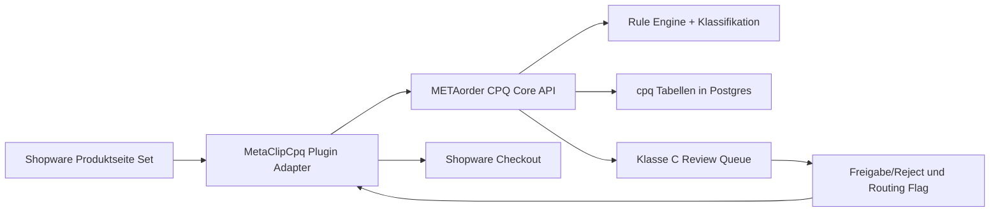

# CPQ Blueprint – METAorder Core + Shopware Adapter

Status: Arbeitsgrundlage fuer Umsetzung ab sofort  
Scope: MVP fuer META CLIP geclincht, CPQ in `METAorder-v2` plus Shopware-Anbindung

## Zielbild

- **Fachlogik zentral in METAorder**: Constraints, Klassifikation A/B/C, Aufschlaege, Fachlastberechnung.
- **Shopware als Runtime-Adapter**: Produktseiten-Einstieg, Cart/Checkout, Persistenz-Snapshot, Order-Routing.
- **MVP-Stufe 1**: Review/Ops in METAorder (Klasse C Queue, Freigabeprozess).
- **MVP-Stufe 2**: Interner Voll-Konfigurator in METAorder.

## Architektur-Schnitt



## Bestehende Bausteine (Ist-Stand)

- API-Routing: `server/cpq/cpqRoutes.ts`
- Regel-Engine: `server/cpq/constraintEngine.ts`
- BOM: `server/cpq/cpqBillOfMaterials.ts`
- Storage-Layer: `server/cpq/cpqStorage.ts`
- Frontend-Konfigurator (intern): `client/src/pages/CPQConfiguratorPage.tsx`
- Tabellen und Typen: `shared/schema.ts` (`cpq`-Schema)
- API-Registrierung: `server/routes.ts`

## Leitprinzipien fuer die Umsetzung

- Keine Doppel-Engine in Shopware und METAorder.
- Regeln als deklarative Daten und versionierbar.
- Harte Constraints blockieren, weiche Constraints erzeugen Disclaimer.
- Klasse C erzeugt immer `review_required`.
- Snapshot-Pattern fuer Konfigurationen (historische Nachvollziehbarkeit).

## Zielmodule in METAorder

### 1) Neue Core-Schicht

- `server/cpq-core/ruleEngineV2.ts`
- `server/cpq-core/classificationService.ts`
- `server/cpq-core/loadComputationService.ts`
- `server/cpq-core/surchargeService.ts`
- `server/cpq-core/contracts.ts`

### 2) API-Fassade fuer Shopware und internes UI

- `server/cpq-core/cpqCoreRoutes.ts`
- Registrierung in `server/routes.ts`

### 3) Review/Ops fuer Klasse C

- `server/cpq-core/reviewQueueService.ts`
- Persistenz in bestehenden oder neuen `cpq`-Tabellen
- UI-Seite in `client/src/pages` plus Komponenten unter `client/src/components/cpq`

## API-Contracts (MVP)

### POST `/api/cpq-core/validate`

Request:

```json
{
  "context": {
    "customerGroup": "b2c",
    "salesChannelId": "..."
  },
  "configuration": {
    "systemVariant": "clip_clinch",
    "frame": { "heightMm": 2000, "depthMm": 400, "widthMm": 1000 },
    "shelves": [{ "material": "stahl_verzinkt", "maxFachlastKg": 150, "count": 5 }],
    "accessories": []
  }
}
```

Response:

```json
{
  "valid": true,
  "classification": "A",
  "errors": [],
  "disclaimers": [],
  "defaultsApplied": [],
  "computed": {
    "effectiveFachlasten": [{ "index": 0, "nominal": 150, "effective": 150 }]
  }
}
```

### POST `/api/cpq-core/price`

Response-Kern:

```json
{
  "classification": "C",
  "surcharges": [{ "attribute": "height", "value": "4000", "type": "percent", "amount": 25 }],
  "totals": { "net": 1000, "gross": 1190 }
}
```

### POST `/api/cpq-core/submit`

Response-Kern:

```json
{
  "configurationId": "uuid",
  "classification": "C",
  "status": "review_required",
  "requiresReview": true
}
```

## Ticket-Backlog (implementierbar)

## Sprint 1 – CPQ Core fachlich stabil

- `CPQ-001` Core-Vertragsmodell anlegen (`contracts.ts`) inkl. Request/Response-Schemata (Zod).
- `CPQ-002` `ruleEngineV2.ts` mit `hard|soft|default|trigger` umsetzen.
- `CPQ-003` `classificationService.ts` fuer A/B/C umsetzen (Sonderhoehe/Sonder-RAL/10T).
- `CPQ-004` `loadComputationService.ts` fuer effective Fachlast inkl. Feldlast-Cap.
- `CPQ-005` Unit-Tests fuer `ruleEngineV2`, Klassifikation und Fachlast.

Akzeptanz:

- Engine verarbeitet mindestens die Kernregeln GEO-01..06, LAST-01..06, OBF-01..04, ANW-01..03.
- Ergebnisobjekt liefert `errors`, `disclaimers`, `defaultsApplied`, `classification`.
- Tests laufen gruen.

## Sprint 2 – Persistenz und Review/Ops in METAorder

- `CPQ-006` Datenmodell erweitern in `shared/schema.ts` fuer Review-Status und Audit-Historie.
- `CPQ-007` Storage-Methoden in `server/cpq/cpqStorage.ts` fuer Queue-Lesen/Statuswechsel.
- `CPQ-008` Endpunkte fuer Review-Queue (`pending`, `approved`, `customer_contact_required`, `rejected`).
- `CPQ-009` UI in METAorder fuer Klasse-C-Queue (Liste, Detail, Aktion, Kommentar).
- `CPQ-010` Benachrichtigungshook (Mail oder Slack) beim Eingang `review_required`.

Akzeptanz:

- Klasse-C-Faelle erscheinen in Queue.
- Vertrieb kann Status inkl. Notiz setzen.
- Freigabe-/Ablehnungsentscheidungen sind auditierbar.

### Stand Sprint 2 (umgesetzt)

- Datenmodell erweitert: `cpq.cpq_configurations` hat jetzt additive Review-Felder (`review_required`, `review_status`, `review_notes`, `reviewed_by`, `review_requested_at`, `reviewed_at`).
- Auditierbarkeit ergänzt: neue Tabelle `cpq.cpq_review_audit` mit Statuswechsel-Historie je Konfiguration.
- Submit-Flow in CPQ Core setzt bei Klasse C automatisch `review_required=true`, `review_status=pending` und `review_requested_at`.
- Erste Vertriebs-UI umgesetzt: `client/src/pages/CPQReviewQueuePage.tsx` (Filter, Liste, Detail, Statuswechsel + Notiz), Route: `/cpq-review-queue`.

### Sprint-2 Endpunkte (Review Queue)

- `GET /api/cpq-core/review-queue?status=pending`  
  Liefert Queue-Einträge je Tenant, optional nach Status gefiltert.
- `GET /api/cpq-core/review-queue/:id`  
  Liefert Detail eines Queue-Eintrags (tenant-scoped).
- `PUT /api/cpq-core/review-queue/:id/status`  
  Aktualisiert Status + Review-Notiz, schreibt Audit-Eintrag.

### Berechtigungen

- Lesen (`GET`): `requireAuth` + `requireViewCPQ`
- Statuswechsel (`PUT`): `requireAuth` + `requireManageCPQ`

## Abschlussstand aktueller Block (Sprint 1+2)

### Done

- CPQ-Core Sprint 1 ist funktionsfähig im Modul `server/cpq-core` (Contracts, Rule-Engine, Klassifikation, Fachlast-Berechnung, Validate/Price/Submit-Routen).
- Sprint 2 Persistenz ist umgesetzt: additive Review-Felder in `cpq.cpq_configurations` plus Audit-Tabelle `cpq.cpq_review_audit`.
- Review-Queue-Endpunkte sind tenant-sicher integriert:
  - `GET /api/cpq-core/review-queue`
  - `GET /api/cpq-core/review-queue/:id`
  - `PUT /api/cpq-core/review-queue/:id/status`
- Submit-Flow setzt Klasse C konsistent auf `review_required` mit `review_status=pending`.
- UI-Basis für Vertrieb ist angebunden (`/cpq-review-queue`, Sidebar-Link, Statuswechsel + Notiz).
- Review-Statuswerte sind konsistent auf den Kernwerten:
  - `pending`, `approved`, `customer_contact_required`, `rejected`, `not_required`

### Offen (bewusst außerhalb dieses Blocks)

- `CPQ-010`: Benachrichtigungshook (Mail/Slack) bei neuem `review_required`.
- Sprint 3+ Themen (Shopware-Adapter-End-to-End, Disclaimer-Flow auf PDP, Order-Routing-Flag im Shop-Prozess, E2E Shop-Pipeline).
- Sprint 4 Themen (KPIs, Betriebsrunbook, Datenqualitätschecks).

## Sprint 3 – Shopware Adapter anschliessen

- `CPQ-011` Plugin-Endpunkte auf Core-API mappen (`validate`, `price`, `submit`).
- `CPQ-012` Hash-Snapshot-Pattern fuer veraenderte Konfigurationen (`unveraendert => Set-SKU`).
- `CPQ-013` Disclaimer-Flow bei Klasse C auf Produktseite.
- `CPQ-014` Order-Routing-Flag (`requires_review`) durchgaengig setzen.
- `CPQ-015` End-to-End Testfall Shop-PDP -> Cart -> Checkout -> METAorder Queue.

Akzeptanz:

- Shop zeigt identische Validierungs- und Klassifikationsergebnisse wie METAorder.
- Klasse C erzeugt immer Review-Queue-Eintrag.
- Keine Checkout-Unterbrechung fuer Klasse A/B.

### Stand Sprint 3 (umgesetzt)

- CPQ-Core-Endpunkte fuer `validate`, `price`, `submit` wurden fuer Adapter-Nutzung gehaertet:
  - Regeln koennen optional vom Client kommen; ohne Regeln werden serverseitige Default-Core-Regeln verwendet.
  - Responses sind konsistent um Entscheidungsfelder erweitert (`status`, `requiresReview`, `reviewStatus`).
  - Klasse C liefert durchgaengig `review_required` + `requiresReview=true`.
- Neuer Runtime-Bridge-Endpunkt:
  - `POST /api/cpq-core/adapter/submit-transfer`
  - Orchestriert `submit` plus Cart/Checkout-Transfer-Vorbereitung ueber bestehende Shopware-/B2B-Integrationspfade.
  - Fuer Klasse C wird Transfer bewusst als `blocked` beantwortet, damit Queue-Prozess greift.
- Cart/Checkout-Transferlogik wurde in einen gemeinsamen Service extrahiert (`server/cpq/cpqCartTransfer.ts`) und wird von:
  - `/api/cpq/cart/transfer`
  - `/api/cpq-core/adapter/submit-transfer`
  gemeinsam genutzt (keine Doppel-Logik).
- CPQ-Konfigurator (`/configurator`) zeigt jetzt den Sprint-3-Fluss explizit:
  - Buttons fuer `Validate`, `Price`, `Submit + Cart-Transfer vorbereiten`
  - Sichtbarer Klasse-C-Hinweis (Review erforderlich)
  - Klarer Submit-/Transfer-Status fuer Adapter-Handshake.
- E2E-Testskript `scripts/testCpqCore.ts` deckt Sprint-3-Kernfluss ab:
  - Konfiguration -> Validate/Price/Submit
  - Klasse A/B akzeptiert
  - Klasse C `review_required`
  - Transfer-Entscheidung `prepared` (A/B) vs. `blocked` (C).

### Offen fuer Sprint 4

- Metriken/KPIs und Betriebsmonitoring fuer `validate|price|submit`.
- Runbook/Incident-Pfade und Datenqualitaets-Checks (PIM-/Regelqualitaet).
- Erweiterte Shop-PDP-UX-Details ausserhalb der Sprint-3-Funktionsabnahme.

## Sprint 4 – Stabilisierung und KPI-Tracking

- `CPQ-016` Latenz- und Fehler-Metriken fuer `validate|price|submit`.
- `CPQ-017` KPI-Tracking fuer Nutzung, Drop-off, Klasse-C-Anteil.
- `CPQ-018` Betriebsrunbook in `docs/` inkl. Incident-Pfad.
- `CPQ-019` Datenqualitaetschecks fuer Pimcore-Regeln/Matrizen.

Akzeptanz:

- Messwerte fuer die in der Strategie definierten MVP-KPIs verfuegbar.
- Incident- und Betriebspfad dokumentiert.

## Sprint 5 – Shopware Storefront CPQ-Basis

- `CPQ-020` Vue-3-Insel auf PDP via Twig-Integration in `MetaClipCpq` bereitstellen.
- `CPQ-021` Storefront-Asset-Struktur + Shopware-Plugin-Wrapper/Bootstrap fuer CPQ.
- `CPQ-022` Debounced Live-Requests (`validate`, `price`) gegen CPQ-Core-Endpunkte.
- `CPQ-023` Disclaimer/Validation-Basis (Hard Errors, Soft Warnings, Klasse-C-Hinweis + Modal).
- `CPQ-024` B2C/B2B-Kontext-Mapping in UI-Payload integrieren.
- `CPQ-025` i18n DE/EN Snippets statt hart codierter UI-Texte (soweit fuer Basisfluss noetig).

### Stand Sprint 5 (umgesetzt)

- Neue Storefront-Basis im Shopware-Plugin angelegt:
  - Twig-PDP-Einstieg: `shopware/custom/plugins/MetaClipCpq/src/Resources/views/storefront/page/product-detail/index.html.twig`
  - Storefront-Assets: `Resources/app/storefront/src/main.js`, Plugin-Wrapper + Vue-Island + SCSS.
  - Snippets DE/EN unter `Resources/snippet/de-DE` und `Resources/snippet/en-GB`.
- Vue-3-Insel mountet auf PDP als Shopware-Plugin (`[data-meta-clip-cpq]`) und startet Live-CPQ-Checks.
- Live-Requests sind debounced und robust gegen Race-Conditions (AbortController + Request-ID-Guard).
- UI-Basis liefert:
  - Hard-Error-Panel (blockierend),
  - Soft-Warning-Panel (Hinweise),
  - Klasse-C-Hinweis mit Modal-Basis.
- Accessibility-Basis eingebaut:
  - `aria-live` Statusmeldungen,
  - Dialog mit `role="dialog"` + `aria-modal`,
  - Escape-Schliessen und Fokus-Rueckgabe.
- B2C/B2B-Mapping ist vorbereitet und wird in Requests als `context.customerGroup` verwendet.
- TODO verify (Shopware Tooling): finale Asset-Build-Integration im Zielsystem mit `bin/build-storefront.sh`.

### Offen fuer Sprint 6

- Finaler End-to-End Cart/Checkout-Handover-Finish im Shop-Kontext.
- Vollstaendige E2E-Testmatrix fuer Shop-PDP -> Cart -> Checkout -> METAorder Queue.
- Produktions-Haertung (Monitoring/Tuning, Rollout-Checks, Ausfallstrategien).

## Sprint 6 – Cart/Checkout-Integration und Contract-Haertung

- `CPQ-026` Cart/Checkout-Handover auf PDP vervollstaendigen (A/B vorbereitet, C klar blockiert).
- `CPQ-027` Shopware-Storefront-Adapter-/CPQ-Core-Contract haerten (Payload + Entscheidungssignale).
- `CPQ-028` B2C/B2B-Kontext im Storefront- und Core-Pfad robust machen (Normalisierung + Edge Cases).
- `CPQ-029` OpenAPI-Generator fuer CPQ-Core-Endpunkte erweitern.
- `CPQ-030` Slim Smoke-Basis fuer Sprint-6-Flows (PDP A/B/C inkl. Transfer-Entscheidung).

### Stand Sprint 6 (umgesetzt)

- Shopware-PDP-Insel fuehrt jetzt den Handover-Endpunkt direkt aus:
  - `POST /api/cpq-core/adapter/submit-transfer`
  - A/B-Konfigurationen koennen direkt vorbereitet werden (`transfer.status=prepared`).
  - Klasse C bleibt sauber geblockt (`transfer.status=blocked`) inkl. klarer Review-Nutzerfuehrung im Response und in der PDP-UI.
- Storefront-/Core-Contract wurde gehaertet:
  - zentrale Submit-/Transfer-Schemata in `server/cpq-core/contracts.ts`,
  - robuste Customer-Group-Normalisierung (`b2c`, `b2b`, `b2b_standard`, `b2b_industrie`),
  - strictere Cart-Transfer-Validierung (produktbezogene Pflichtfelder + positive Mengen).
- B2C/B2B-Kontextfluss ist robuster:
  - Kontextfelder (`customerId`, `salesChannelId`) werden in Core-Payloads mitgegeben,
  - B2B-Hinweistext auf der PDP fuer indikative Preisanzeige,
  - Edge Cases fuer fehlende Produktdaten oder ungueltige Mengen mit klaren Fehlhinweisen.
- OpenAPI-/Contract-Haertung:
  - OpenAPI-Generator liest nun auch `server/cpq-core/cpqCoreRoutes.ts`,
  - CPQ-Core-Endpunkte sind dadurch im OpenAPI-Export enthalten.
- Smoke-Basis fuer Sprint-6-Flows aktualisiert:
  - `scripts/testCpqCore.ts` prueft A/B/C-Entscheidungspfad, Transfer-Entscheidung, C-Review-Hinweis sowie Kontextnormalisierung und Adapter-Payload-Guards.

### Offen nach Sprint 6

- Echte Browser-E2E-Pipeline (Shopware PDP -> Cart -> Checkout -> METAorder Queue) mit live Shopware-Runtime und Assertions im CI.
- Produktions-Haertung ausserhalb MVP-Basis:
  - Monitoring-/Alerting-Feinschliff fuer Shopware-Storefront-Fehler,
  - Rollout-/Fallback-Playbooks fuer Adapter-Ausfaelle.

## Delivery-Reihenfolge (ab morgen)

1. `CPQ-001` bis `CPQ-004` zusammen liefern.
2. Dann `CPQ-005` Tests.
3. Danach `CPQ-006` und `CPQ-007` (Persistenz/Storage).
4. Anschliessend Queue-Endpunkte/UI `CPQ-008` bis `CPQ-010`.

## Definition of Done fuer jedes Ticket

- Code + Tests + kurze Doku-Notiz.
- Tenant-Sicherheit beachtet (Filter auf `tenantId`).
- Keine breaking changes fuer bestehende `/api/cpq/*` Endpunkte ohne Kompatibilitaets-Layer.
- Docker-Run bleibt konsistent (`npm run dev` und Containerpfad unveraendert).
