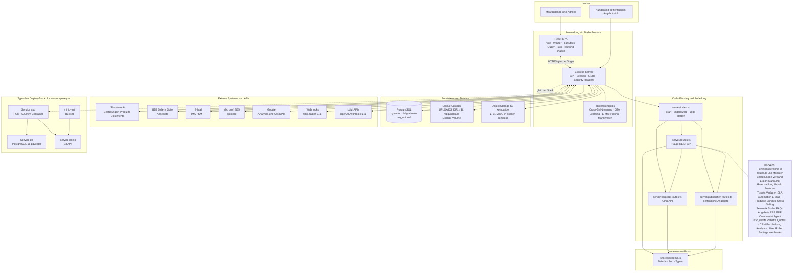

# METAorder: System-Poster (Architektur)

Ein zusammenhaengendes Ueberblicksdiagramm fuer Praesentationen, Onboarding und Reviews. Fuer Details siehe [architecture.md](architecture.md) und [docker.md](docker.md).

**Rendering:** Mermaid wird in GitHub, GitLab, vielen Markdown-Viewern und in Cursor unterstuetzt. Bei sehr kleinem Viewer-Fenster horizontal scrollen oder Zoom nutzen.

---

## Gesamtarchitektur (ein Diagramm)

Die gestrichelte Linie `exp -.-> c_app` ist eine **Zuordnung** (logischer Prozess zum Compose-Service **app**), kein technischer Aufruf innerhalb eines Containers.

Zusaetzlich: Die **logische** Anwendung (Prozess) entspricht dem **app**-Service; **db** und **minio** sind die im Compose abgebildeten Abhaengigkeiten.

---

## Funktionslandkarte UI (Orientierung)

Die Oberflaeche liegt unter `client/src/pages/` und spricht die gleichen `/api/...`-Endpunkte an wie der Knoten **Backend-Funktionsbereiche** im Diagramm.

| Bereich (Beispiele) | Seiten (Auszug) |
|---------------------|-----------------|
| Bestellungen & Logistik | `OrdersPage`, `DelayedOrdersPage`, `ShippingPage`, `ExportPage` |
| Dokumente & Zahlung | `DunningPreviewPage`, Ratenzahlung ueber Bestell-API |
| Angebote | `OffersPage`, `OfferPreviewPage`, `PublicOfferPage` |
| CPQ | `CPQConfiguratorPage`, `CPQAdminPage` |
| Verkauf & Daten | `ProductsPage`, `BundlesPage`, `CrossSellingRulesPage` |
| Support & Automatisierung | `TicketsPage`, `TicketRulesPage`, `TemplatesPage`, `AutomationRulesPage` |
| Steuerung & Compliance | `UsersPage`, `RolesPage`, `SettingsPage`, `WebhookLogsPage` |
| Analyse & KI | `AnalyticsPage`, `SemanticSearchPage`, `CrmPage`, `AccountingPage` |

---

## Build und Laufzeit (Kurz)

| Befehl | Bedeutung |
|--------|-----------|
| `npm run dev` | Entwicklung: `tsx server/index.ts`, SPA via Vite-Middleware |
| `npm run build` | OpenAPI, Vite-Client, esbuild-Server nach `dist/` |
| `npm start` | Production: `node dist/index.js` |
| `npm run db:migrate` | SQL unter `migrations/` (u. a. Container-Start) |

Docker: siehe [docker.md](docker.md) — persistent **`/app/uploads`** und DB-Volume wie im Compose-File.
