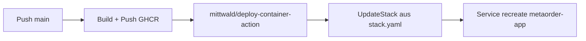

# Mittwald Deployment (mStudio Container Hosting)

Diese Anleitung richtet einen reproduzierbaren Deployment-Prozess fuer `METAorder-v2` auf **Mittwald mStudio** ein:

1. Image in **GHCR** bauen und pushen
2. Stack per **mittwald/deploy-container-action** aus [`stack.yaml`](../deploy/mittwald/stack.yaml) deployen
3. Updates automatisch via **GitHub Actions** bei Push auf `main`
4. Rollback per festem Image-Tag (SHA)

## 1) Voraussetzungen

- GitHub-Repo: **`META-Regalbau/METAorder-v2`** (Workflow + Secrets hier)
- Container-Registry: **GHCR** `ghcr.io/meta-regalbau/metaorder-v2`
- Mittwald-Projekt: **`p-bbpye5`** (Domain: `p-bbpye5.project.space`)
- Stack-Definition: [`deploy/mittwald/stack.yaml`](../deploy/mittwald/stack.yaml)

## 2) GitHub Secrets und Variables

### Secrets (Repository **META-Regalbau/METAorder-v2** → Settings → Secrets and variables → Actions)

> **Haeufigster Fehler:** Secrets im falschen Repo (`about-design/META-Order-v3`) oder als **Organization Secret** ohne Zugriff fuer dieses Repo.

| Secret | Pflicht | Beschreibung |
|--------|---------|--------------|
| `MITTWALD_API_TOKEN` | ja | mStudio API-Token |
| `MITTWALD_STACK_ID` | ja* | Stack-UUID (alternativ als **Variable** moeglich) |
| `DATABASE_URL` | ja | PostgreSQL Connection String |
| `SESSION_SECRET` | ja | Session-Verschluesselung |
| `ENCRYPTION_KEY` | ja | App-Verschluesselung |
| `METAORDER_INTEGRATION_API_KEY` | nein | Integration API |
| `S3_*` | nein | S3/MinIO fuer Ticket-Anhaenge |

### Variables (optional, nicht-geheim)

| Variable | Empfohlen fuer Projekt `p-bbpye5` |
|----------|-----------------------------------|
| `PUBLIC_APP_URL` | `https://p-bbpye5.project.space` |
| `REQUEST_LOG_SLOW_MS` | `1500` |
| `METAORDER_STRICT_TENANT` | `true` |
| `S3_REGION` | `us-east-1` |
| `COMMERCIAL_AGENT_ENABLED` | `true` |
| `AI_MODE` | `openai_optional` |

### Zielprojekt Mittwald

| Feld | Wert |
|------|------|
| Projekt-Short-ID | `p-bbpye5` |
| Stack-ID | `a86b11e2-5ea0-4777-a252-89d9a172c2c5` → GitHub Secret `MITTWALD_STACK_ID` |
| Projekt-Domain | `p-bbpye5.project.space` |
| Container-Port (App) | `5000` |

**Stack-ID in GitHub eintragen:**

Repository **META-Regalbau/METAorder-v2** → Settings → Secrets → `MITTWALD_STACK_ID` = `a86b11e2-5ea0-4777-a252-89d9a172c2c5`

**Ingress / Domain:** In mStudio den Container-Port **5000** auf die gewuenschte Domain routen (z. B. `p-bbpye5.project.space` oder eigene Domain).

## 3) GHCR-Zugriff fuer Mittwald

Mittwald muss Images aus GHCR pullen koennen:

- **Option A:** Package `metaorder-v2` auf **public** stellen
- **Option B:** Registry-Credentials im mStudio-Stack (GitHub PAT mit `read:packages`)

## 4) Stack-Dateien

| Datei | Zweck |
|-------|--------|
| [`stack.yaml`](../deploy/mittwald/stack.yaml) | **Quelle fuer CI** — mStudio Stack (Action `deploy-container-action`) |
| [`docker-compose.mittwald.yml`](../deploy/mittwald/docker-compose.mittwald.yml) | Referenz / manuelles `mw stack deploy` lokal |
| [`app.env.example`](../deploy/mittwald/app.env.example) | Vorlage fuer lokales Erst-Setup |

> **Wichtig:** Die Action ueberschreibt den Stack komplett gemaess `stack.yaml`. Manuelle Aenderungen in mStudio, die nicht im Repo stehen, gehen beim Deploy verloren.

## 5) Automatischer Ablauf (GitHub Actions)

Workflow: [`.github/workflows/deploy-mittwald.yml`](../.github/workflows/deploy-mittwald.yml) im Repo **META-Regalbau/METAorder-v2**



Bei Push auf `main` (Aenderungen unter `METAorder-v2/**`):

1. Docker-Image bauen → GHCR `:<sha>` + `:latest`
2. `mittwald/deploy-container-action@v1` mit `stack.yaml` und Secrets
3. Stack-Update inkl. neues Image, Env-Vars, Volume, Port 5000

Ohne Mittwald-/App-Secrets schlaegt der Deploy-Job fehl und listet **welche** Werte fehlen (Schritt *Check Mittwald configuration*).

### Deploy wird uebersprungen / schlaegt fehl

1. Secrets in **`META-Regalbau/METAorder-v2`** pruefen (nicht im Parent-Repo)
2. Exakte Namen: `MITTWALD_API_TOKEN`, `MITTWALD_STACK_ID`, `DATABASE_URL`, `SESSION_SECRET`, `ENCRYPTION_KEY`
3. `MITTWALD_STACK_ID` darf auch unter **Variables** stehen: `a86b11e2-5ea0-4777-a252-89d9a172c2c5`
4. Organization Secrets: Repo **META-Regalbau/METAorder-v2** muss Zugriff haben
5. Workflow erneut starten und Log *Check Mittwald configuration* lesen

## 6) Rollback

GitHub Actions → *Deploy METAorder-v2 to Mittwald* → Run workflow:

- `deploy_only`: **true**
- `image_tag`: stabiler Git-SHA (z. B. `abc1234`)

## 7) Lokales Erst-Setup (optional)

Falls der Stack noch nicht existiert (Projekt **p-bbpye5**):

```bash
cd METAorder-v2
cp deploy/mittwald/app.env.example deploy/mittwald/app.env
# DATABASE_URL, SESSION_SECRET, ENCRYPTION_KEY anpassen

mw stack deploy \
  -f deploy/mittwald/docker-compose.mittwald.yml \
  --env-file deploy/mittwald/app.env \
  --project-id p-bbpye5
```

Danach `MITTWALD_STACK_ID` in GitHub Secrets eintragen. Weitere Deploys laufen ueber GitHub Actions.

## 8) Betriebshinweise

- Healthcheck in der App: `GET /healthz`
- Uploads persistent: Volume `metaorder_uploads` → `/app/uploads`
- SQL-Migrationen beim Containerstart (`scripts/docker-entrypoint.sh`)
- Backups: Datenbank + Upload-Volume

## Referenzen

- [mittwald/deploy-container-action](https://github.com/mittwald/deploy-container-action)
- [Mittwald Container Actions Guide](https://developer.mittwald.de/docs/v2/guides/deployment/container-actions/)
- [Docker-Setup lokal](docker.md)
